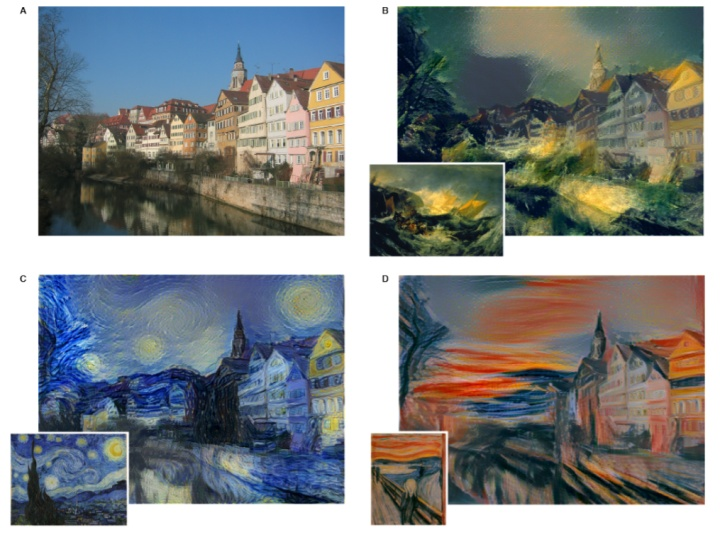

# 机器学习的应用

| 应用                           | 定义                                           | 实例                                                         | 模型       |
| ------------------------------ | ---------------------------------------------- | ------------------------------------------------------------ | ---------- |
| 图像分类(image classification) | 将输入的图像正确分类                           | 手写字符识别、服装类型识别、sign language image classification、树叶物种识别、庄稼类型识别 | CNN        |
| 人脸识别                       | 识别出人脸对应的人的身份                       | 刷脸门禁、刷脸支付                                           | CNN        |
| 物体检测                       | 检测出图片中物体的位置和名称                   |                                                              | YOLO       |
| 画作生成                       | 生成一幅画                                     |                                                              | GAN        |
| 图图转化                       |                                                |                                                              | GAN        |
| 疾病检测                       |                                                |                                                              |            |
| 语音唤醒                       | 通过triger word唤醒某软件或硬件                | 百度的图的triger word "小度小度"                             | RNN        |
| 语音识别                       | 识别出语音对应的文字                           | 微信翻译                                                     | RNN        |
| 序列生成                       | 生成一个序列                                   | 音乐生成、文本生成                                           | RNN        |
| 机器翻译                       | 计算机将一门语言翻译成另一门语言               |                                                              | RNN        |
| 个性化推荐                     | 根据用户的个性，向用户推荐其有可能喜欢的物品   | 淘宝的猜你喜欢                                               | 矩阵分解   |
| 计算广告                       | 根据用户的个性，向用户展示其点击可能性高的广告 | 微信朋友圈广告                                               | 因子分解机 |
| 人机对弈                       | 计算机与人类下棋并战胜人类                     | google的alpha go                                             | CNN        |
| 风格转移                       | 将一个东西的风格，转移到另一个同类东西上       | 百度地图的个性化导航语音                                     | CNN        |
| 异常检测                       |                                                |                                                              |            |
| 自动驾驶                       |                                                |                                                              |            |
| 价格预测                       | 预测某东西的价格                               | 房价预测、物品价格预测                                       | 线性回归   |
| 游戏机器人                     | 在游戏中的机器人玩家                           |                                                              |            |
| 视频活动检测                   |                                                |                                                              |            |
| 音乐风格分类                   |                                                |                                                              |            |
| 口音转移                       |                                                |                                                              |            |
| 信贷风控                       |                                                |                                                              |            |
| 欺诈检测                       |                                                |                                                              |            |
| 个性化教育                     |                                                |                                                              |            |
| 精准化农业                     |                                                |                                                              |            |

## 图像分类

手写字符识别：

服装类型识别：

sign language image classification：

树叶物种识别：

庄稼类型识别:

## 图图转化

## 物体检测

## 风格转移

## 价格预测

从图片预测物品价格：

